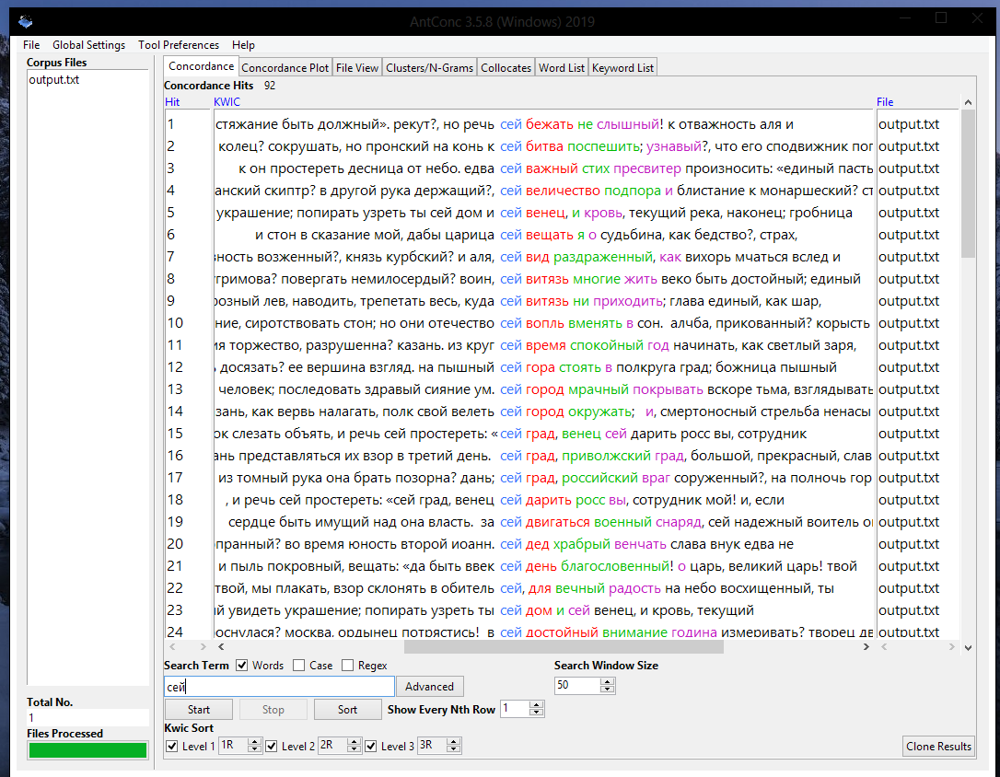
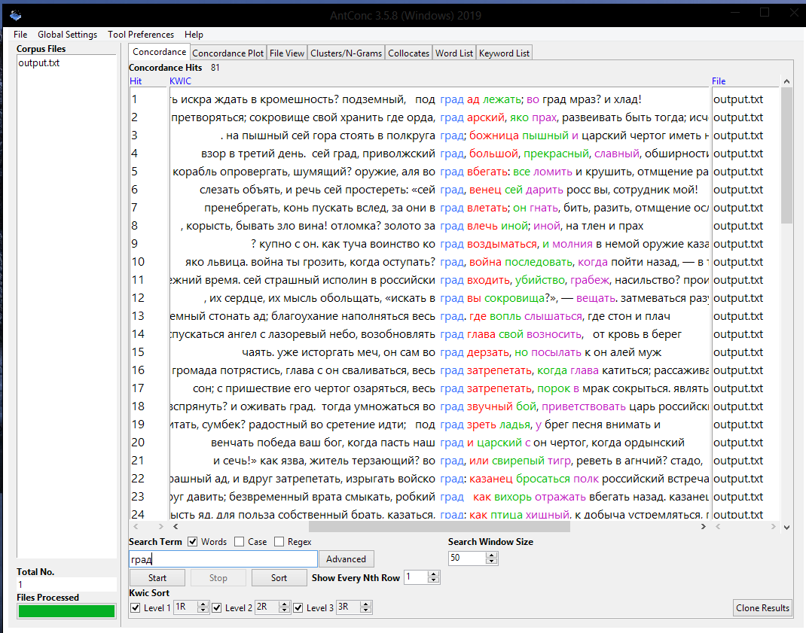
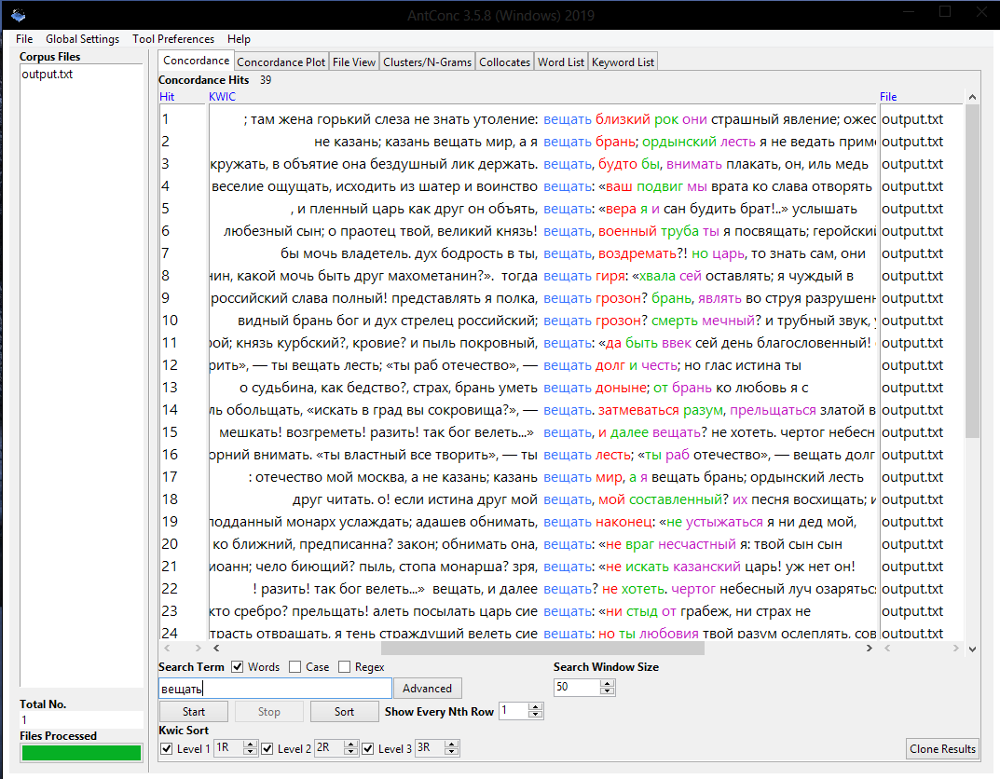
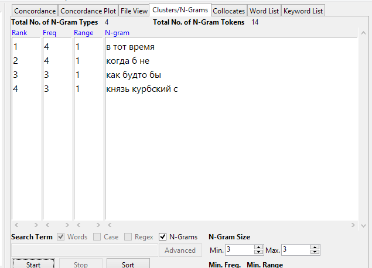
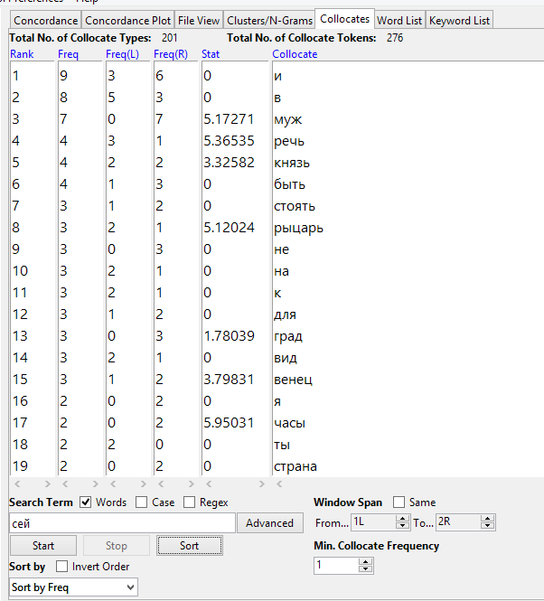
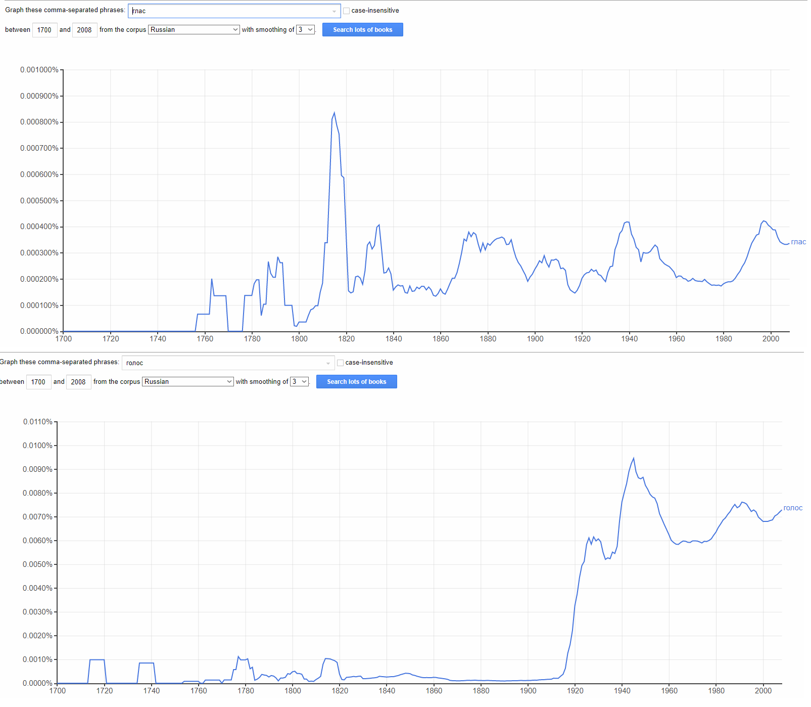
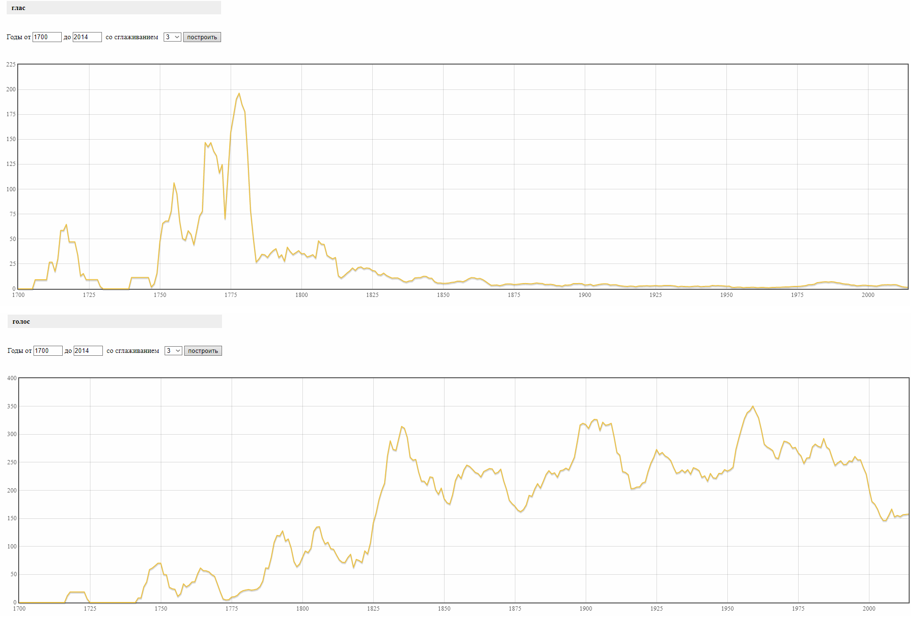
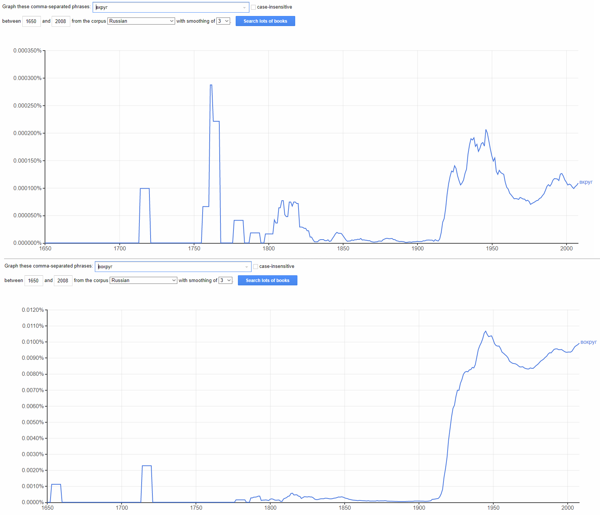
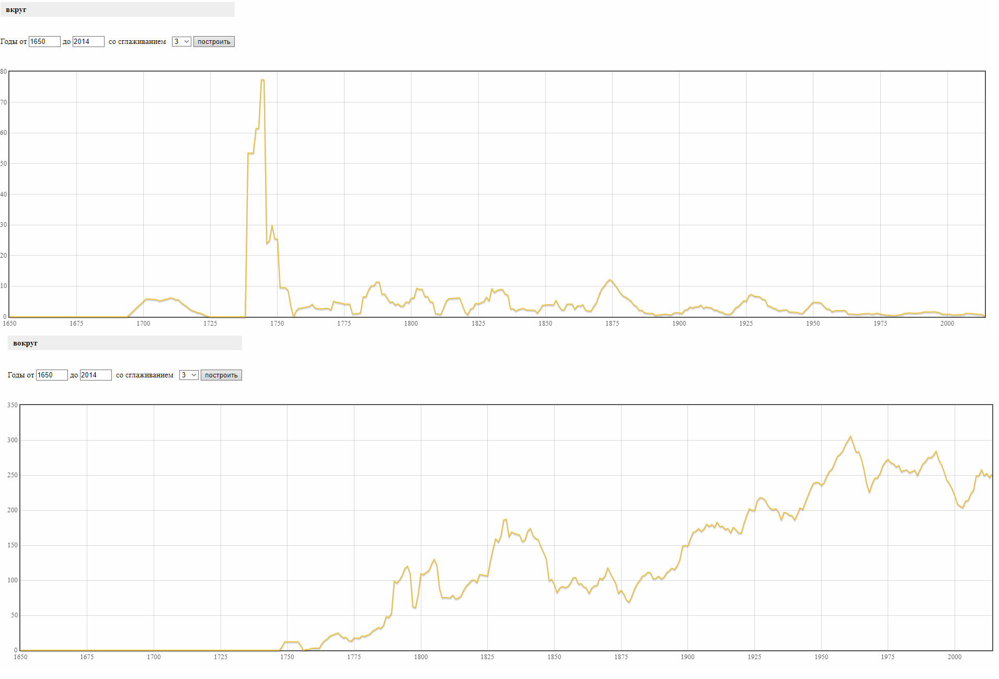

# HW3
<b>Часть I. </b>

<b>Устаревшие слова: </b>
  
Сей
  
  

Град

  

Вещать

  

N-грамы

  

Коллокаты

  

<b>Часть II. </b>

*В то время юный царь в столицу уклонился,
Где вместо гласа труб забавами пленился.
О ты, на небесах живущий в тишине!
Прости, великий царь, мою отважность мне,
Что утро дней твоих во тьме дерзну представить,
Пресветлый полдень твой громчае буду славить;
Велик, что бурю ты вкруг царства укротил,
Но больше, что страстям душевным воспретил.*

Глас - голос; НКРЯ фиксирует первое упоминание намного раньше, чем Гугл, разница аж в несколько десятилетий. Пик использования "гласа" также у Гугла смещён на несколько десятилетий позднее, это позволяет сделать вывод, что с текстами старее сотни лет на русском языке у Google NGrams ниочинь. Судя по тому же Гуглу, во второй половине 1910-ых все ну очень резко стали использовать слово "голос", резче взлетает только график, отслеживающий популярность запроса "Last Christmas" в декабре. В НКРЯ это постепенное учащение употребления, начавшееся после пика использования "гласа". 

  
  

Вкруг - вокруг; график Гугла для слова "вкруг" до 1900 года настолько квадратный, что об него порезаться можно, тогда как НКРЯ, хотя и фиксирует очень резкий "взлёт", всё же выглядит более адекватно. Оба графика отображают неохотное употребление слова "вкруг" и популярность слова "вокруг" с начала XX века. Беру свои слова по поводу графика слова "голос" обратно, "вокруг" у Гугла взлетает ещё резче (у НКРЯ снова плавный рост аж с конца XVIII века). 

  
  

Вывод? Гуглу явно не хватает данных из более старых книг, скорее всего, проблемы с распознаванием дореволюционной орфографии.

IPM Глас - 1432/283431966x1000000 = ~5.05

IPM Вкруг - 674/283431966x1000000 = ~2.38

<b>Часть III. </b>

Как человек с НИСа "Текстология...", где мы изучаем, в том числе, проблемы авторства и датировки произведений, считаю корпус отличным помощником в данном деле. Может, результат будет не супер точный даже в НКРЯ, но это в любом случае лучше, чем ручной поиск. Гугл Нграмы скорее расчитаны на англоязычные тексты, так что им бы я воспользовалась при работе с зарубежной литературой. 

В понимании текста работа с НКРЯ и Нграмами не особо помогла, так как текст был достаточно понятен и до этого. Ну такое. 

Моя курсовая работа связана с корпусом текстов и повторяемостью слов, так что полученные навыки определённо пригодятся в ближайший месяц.
